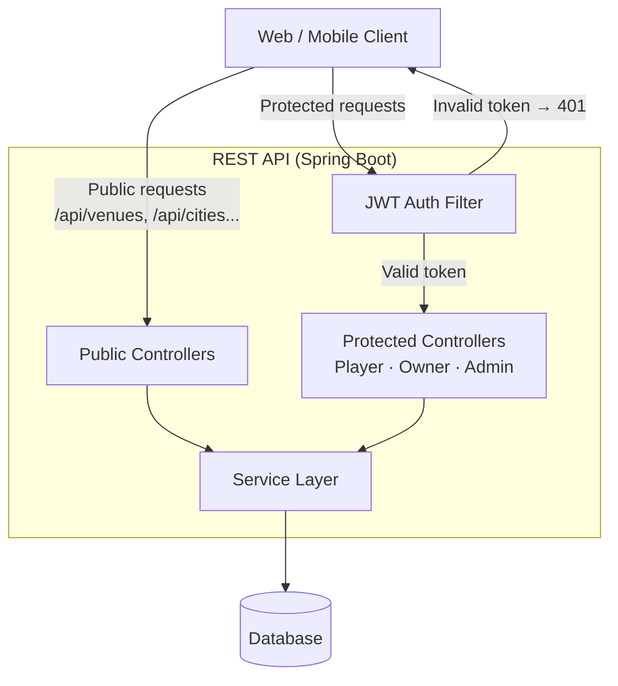

# Sports Hub API

[](https://ccasro-hub.mintlify.app/introduction)

## 📄 Description

This repository contains a **REST API for a Sports Venue Booking Platform**, developed using **Spring Boot**, with full support for venue management, resource scheduling, player matchmaking, and booking workflows.

The application allows managing sports venues and their resources, including court bookings, match creation, player invitations, and administrative oversight.

The API supports:

* Creating and managing sports venues and resources
* Booking court slots with real-time availability
* Intelligent match creation and player matchmaking
* Player invitations, check-ins, and absence reporting
* Full admin panel for users, venues, resources, and bookings
* Owner dashboard for managing venues, resources, and pricing rules
* User profile and avatar management
* City listing and nearby venue search

Venue and resource data flows through a **role-based REST API** with JWT Bearer Token authentication, serving **Players**, **Owners**, and **Admins**.

---

## 🏗️ Architecture

This project is implemented using:

* RESTful API design following OpenAPI 3.1.0 specification
* Role-based access control (PLAYER / OWNER / ADMIN)
* JWT Bearer Token authentication
* Domain-driven resource modeling (Venues → Resources → Bookings → Matches)

Role responsibilities:

* **Player** — browse venues, book slots, join or organize matches
* **Owner** — create and manage venues, resources, schedules, and pricing
* **Admin** — full platform oversight, approval workflows, and statistics

---

## 🧭 Architecture Diagram



---

## 💻 Technologies Used

- Java / Spring Boot
- OpenAPI 3.1.0 / Swagger
- JWT Bearer Token Authentication
- RESTful JSON API
- Docker & Docker Compose

---

## 📋 Requirements

- Java 21
- Maven
- Docker & Docker Compose
- IDE (IntelliJ IDEA recommended)

---

## 🛠️ Installation

1. Clone the repository:

```bash
git clone https://github.com/your-org/sports-hub-api
```

2. Open the project in your IDE (e.g., IntelliJ IDEA)
3. Ensure Maven dependencies are downloaded automatically

---

## ▶️ Execution (Docker)

Run the full application stack using Docker:

```bash
docker compose up -d
```

The API will be available at:

```
http://localhost:8080
```

Swagger documentation:

```
http://localhost:8080/swagger-ui.html
```

---

## ▶️ Execution (Local)

Requirements:

* Database running and configured

Run:

```bash
./mvnw spring-boot:run
```

---

## 🌐 API Endpoints

### 👤 User Profile

| Method | Endpoint            | Description                        |
|--------|---------------------|------------------------------------|
| GET    | /api/me             | Get current user profile           |
| PUT    | /api/me             | Update current user profile        |
| PATCH  | /api/me/avatar      | Update user avatar                 |
| POST   | /api/me/request-owner | Request owner role               |

---

### 🏟️ Public — Venues & Resources

| Method | Endpoint                        | Description                          |
|--------|---------------------------------|--------------------------------------|
| GET    | /api/venues                     | List all active venues               |
| GET    | /api/venues/{id}                | Get venue detail                     |
| GET    | /api/venues/nearby              | Find venues near a location          |
| GET    | /api/venues/{venueId}/resources | List active resources of a venue     |
| GET    | /api/resources/{id}/slots       | Get slot availability for a resource |
| GET    | /api/cities                     | List available cities                |

---

### 🏠 Owner — Venues

| Method | Endpoint                          | Description              |
|--------|-----------------------------------|--------------------------|
| GET    | /api/owner/venues                 | Get my venues            |
| POST   | /api/owner/venues                 | Create a new venue       |
| PUT    | /api/owner/venues/{id}            | Update a venue           |
| PATCH  | /api/owner/venues/{id}/suspend    | Suspend a venue          |
| PATCH  | /api/owner/venues/{id}/reactivate | Reactivate a venue       |
| POST   | /api/owner/venues/{id}/images     | Add image to venue       |
| DELETE | /api/owner/venues/{id}/images/{imageId} | Remove image from venue |

---

### 🎾 Owner — Resources

| Method | Endpoint                                      | Description                     |
|--------|-----------------------------------------------|---------------------------------|
| GET    | /api/owner/resources                          | List all resources of my venues |
| POST   | /api/owner/venues/{venueId}/resources         | Create resource in a venue      |
| PUT    | /api/owner/resources/{id}/schedules           | Set schedule for a resource     |
| PATCH  | /api/owner/resources/{id}/suspend             | Suspend a resource              |
| PATCH  | /api/owner/resources/{id}/reactivate          | Reactivate a resource           |
| POST   | /api/owner/resources/{id}/price-rules         | Add a price rule                |
| DELETE | /api/owner/resources/{id}/price-rules/{ruleId}| Remove a price rule             |
| POST   | /api/owner/resources/{id}/images              | Add image to a resource         |
| DELETE | /api/owner/resources/{id}/images/{imageId}    | Remove image from resource      |

---

### 📅 Bookings

| Method | Endpoint                          | Description                      |
|--------|-----------------------------------|----------------------------------|
| POST   | /api/bookings                     | Create a new booking             |
| GET    | /api/bookings/my                  | Get my bookings                  |
| PATCH  | /api/bookings/{id}/cancel         | Cancel my booking                |
| GET    | /api/owner/bookings               | Get all bookings of my venues    |
| GET    | /api/owner/venues/{venueId}/bookings | Get bookings for a venue      |

---

### 🤝 Match — Matchmaking

| Method | Endpoint                               | Description                                   |
|--------|----------------------------------------|-----------------------------------------------|
| GET    | /api/match/search                      | Search available slots for a match            |
| POST   | /api/match/requests                    | Create a match request                        |
| GET    | /api/match/requests/my                 | Get matches I am participating in             |
| GET    | /api/match/requests/{id}               | Get match request by ID                       |
| DELETE | /api/match/requests/{id}               | Cancel a match request (organizer only)       |
| POST   | /api/match/requests/{id}/confirm-payment | Confirm organizer payment and open match    |
| POST   | /api/match/requests/{id}/checkin       | Check in to a match using GPS                 |
| POST   | /api/match/requests/{id}/absence       | Report absence from a match                   |
| DELETE | /api/match/requests/{id}/leave         | Leave a match (non-organizer, >48h before)    |
| GET    | /api/match/join/{token}               | Get match by invitation token                 |
| POST   | /api/match/join/{token}               | Join a match via invitation token             |
| GET    | /api/match/invitations                | Get my match invitations                      |
| POST   | /api/match/invitations/{id}/accept    | Accept a match invitation                     |
| POST   | /api/match/invitations/{id}/decline   | Decline a match invitation                    |

---

### 🛡️ Admin

| Method | Endpoint                              | Description                        |
|--------|---------------------------------------|------------------------------------|
| GET    | /api/admin/stats                      | Get platform statistics            |
| GET    | /api/admin/venues                     | List all venues                    |
| GET    | /api/admin/venues/pending             | List pending review venues         |
| PATCH  | /api/admin/venues/{id}/approve        | Approve a venue                    |
| PATCH  | /api/admin/venues/{id}/reject         | Reject a venue                     |
| PATCH  | /api/admin/venues/{id}/suspend        | Suspend a venue                    |
| GET    | /api/admin/resources                  | List all resources                 |
| GET    | /api/admin/resources/pending          | List pending resources             |
| PATCH  | /api/admin/resources/{id}/approve     | Approve a resource                 |
| PATCH  | /api/admin/resources/{id}/reject      | Reject a resource                  |
| PATCH  | /api/admin/resources/{id}/suspend     | Suspend a resource                 |
| GET    | /api/admin/users                      | List all users                     |
| GET    | /api/admin/users/{id}                 | Get user by ID                     |
| GET    | /api/admin/users/pending-owners       | List pending owner requests        |
| PATCH  | /api/admin/users/{id}/approve-owner   | Approve owner request              |
| PATCH  | /api/admin/users/{id}/reject-owner    | Reject owner request               |
| PATCH  | /api/admin/users/{id}/role            | Change user role                   |
| PATCH  | /api/admin/users/{id}/toggle-active   | Toggle user active status          |
| GET    | /api/admin/bookings                   | List all bookings                  |
| PATCH  | /api/admin/bookings/{id}/cancel       | Cancel a booking                   |

---

## 📖 API Documentation

📚 Documentation: [ccasro-hub.mintlify.app](https://ccasro-hub.mintlify.app/introduction)

Swagger UI (local):

```
http://localhost:8080/swagger-ui.html
```

OpenAPI specification:

```
http://localhost:8080/v3/api-docs
```

---

## 🔐 Authentication

All protected endpoints require a **JWT Bearer Token** in the `Authorization` header:

```
Authorization: Bearer <your_token>
```

Public endpoints (venue listing, slot availability, city list) do not require authentication.

---

## 🎮 Match Formats & Skill Levels

**Formats:**

| Value        | Description     |
|--------------|-----------------|
| ONE_VS_ONE   | 1 vs 1 match    |
| TWO_VS_TWO   | 2 vs 2 match    |

**Skill Levels:**

| Value        | Description        |
|--------------|--------------------|
| BEGINNER     | Beginner players   |
| INTERMEDIATE | Intermediate level |
| ADVANCED     | Advanced players   |
| ANY          | Any skill level    |

---

## 🏅 Supported Sports

| Value     |
|-----------|
| PADEL     |
| TENNIS    |
| SQUASH    |
| BADMINTON |

---

## 🗓️ Scheduling

Resources support per-day-of-week schedule configuration using the `SetScheduleRequest`:

- Days: `MON`, `TUE`, `WED`, `THU`, `FRI`, `SAT`, `SUN`
- Opening time and closing time per day

---

## 💰 Pricing Rules

Price rules can be configured per resource with:

- Day type: `WEEKDAY`, `WEEKEND`, or specific day
- Start and end time range
- Price and currency

---

## 🧪 Testing (Dev)

Development payment simulation endpoints are available for testing booking payment flows:

| Method | Endpoint                                         | Description                     |
|--------|--------------------------------------------------|---------------------------------|
| POST   | /api/dev/payments/{bookingId}/confirm            | Simulate successful payment     |
| POST   | /api/dev/payments/{bookingId}/fail               | Simulate failed payment         |
| POST   | /api/dev/payments/{bookingId}/player/{playerId}/confirm | Confirm player payment   |

---

## 🤝 Contributions

* Use feature branches for development
* Follow Conventional Commits:
  * `feat:` — new features
  * `fix:` — bug fixes
  * `refactor:` — code improvements
  * `test:` — test coverage
  * `docs:` — documentation updates
* Keep commits small and focused
* Do not commit secrets or compiled files
* Use Pull Requests for improvements

---

## 📌 Notes

This project demonstrates:

* Full-featured sports venue booking platform
* Role-based REST API (Player / Owner / Admin)
* Intelligent match search and matchmaking with GPS support
* Approval workflows for venues and resources
* Dynamic pricing rules and weekly scheduling
* JWT-secured endpoints with OpenAPI documentation
* Cloud-ready containerized deployment